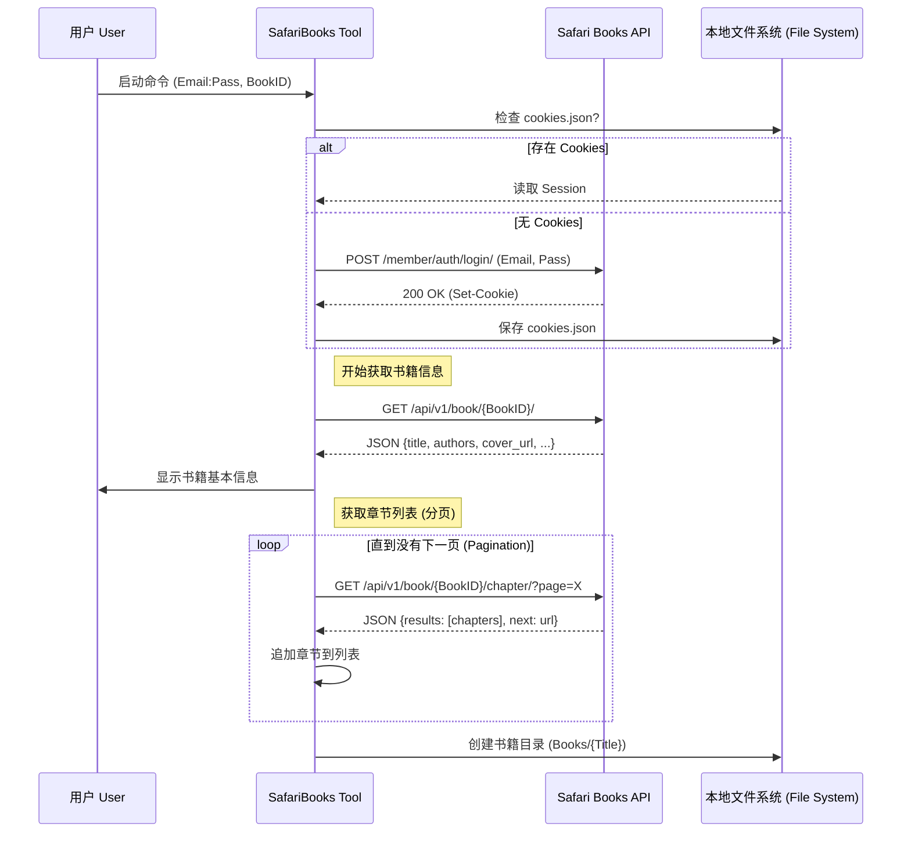
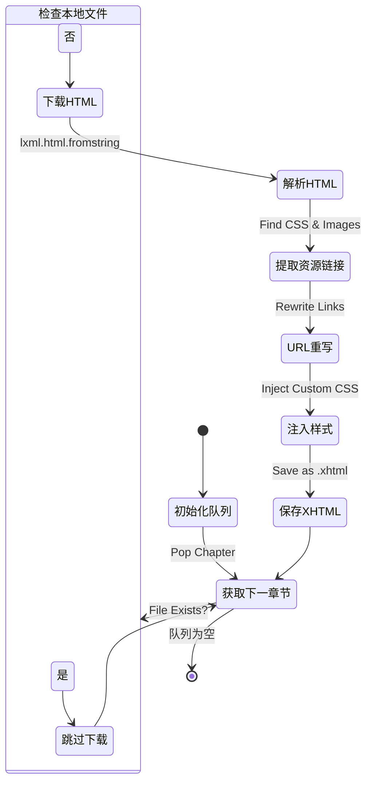
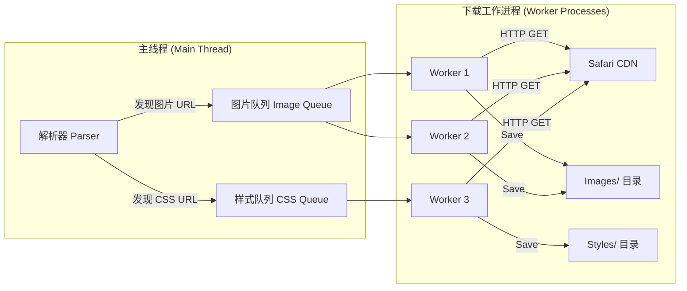

# 2. 核心逻辑与 API 交互 (Core Logic & API)

## 简介
本文深入探讨 `SafariBooks` 工具内部的运作机制。它通过模拟标准的用户浏览器行为，利用 Safari Books Online 的 REST API 获取书籍内容。

核心逻辑分为三个阶段：**认证 (Authentication)**、**内容抓取 (Crawling)**、**资源下载 (Assets Download)**。

---

## 阶段一：认证与元数据 (Auth & Metadata)

这是程序启动后的第一步，目的是确保我们有权限访问书籍，并知道这本书包含了多少个章节。

### 关键点分析
1.  **Session 持久化**: 登录成功后，Cookies 会被保存到 `cookies.json`。下次运行时，如果 Cookies 未过期，可以直接跳过登录步骤，提升体验。
2.  **递归分页 (Recursive Pagination)**: 书籍章节列表通常很大，API 会分页返回。程序会自动请求下一页，直到获取所有章节。

---

## 阶段二：内容抓取与处理 (Content Crawling)

拿到章节列表后，程序开始逐个下载章节内容（HTML）。这一步不仅是下载，还包括了重要的**解析与清洗 (Parsing & Cleaning)** 工作。

### 关键逻辑：HTML 转换 (HTML Transformation)
原始网页的 HTML 不能直接用于 EPUB。我们需要做以下转换：
1.  **链接本地化 (Localization)**: 将网页中的图片链接（如 `https://safari.../image.png`）替换为相对路径（如 `Images/image.png`），以便离线查看。
2.  **样式注入 (CSS Injection)**:
    - 针对 Kindle 设备，移除可能导致显示异常的 `overflow: hidden` 等样式 (`--no-kindle` 选项)。
    - 注入基础排版样式。
3.  **资源收集**: 在解析 HTML 时，程序会“顺手”把遇到的 CSS 和图片 URL 放入待下载队列。

---

## 阶段三：并发资源下载 (Concurrent Assets Download)

为了加快速度，图片和 CSS 文件的下载是并发进行的。

### 性能优化点
- **多进程/多线程**: 利用 `multiprocessing` (Linux/Mac) 或多线程 (Windows) 并行下载资源，显著减少等待时间。
- **去重 (Deduplication)**: 即使多章引用了同一张图片，程序也会检查是否已下载，避免重复请求。

---
*下一篇文档将展示这些数据如何被组装成最终的 EPUB 文件。*
