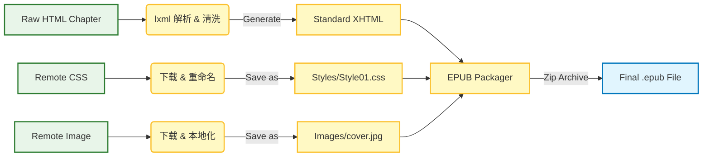

# 3. 数据流与 EPUB 打包 (Data Flow & Packaging)

## 简介
这是整个流程的终点站。我们已经有了分散的文本 (XHTML)、样式 (CSS) 和图片 (Images)。现在的任务是将它们**有序地组装**成一个标准的 EPUB 电子书文件。

---

## 数据转换管道 (Data Transformation Pipeline)

数据从原始的 Safari Books 网页格式流向最终的 EPUB 文件，经历了一系列精细的转换。



### 关键转换细节
1.  **HTML -> XHTML**: EPUB 要求严格的 XHTML 语法（必须有结束标签，属性值必须加引号等）。`lxml` 库负责把松散的 HTML 转化为合规的 XHTML。
2.  **重命名策略 (Renaming Strategy)**:
    - 章节文件名：保持原样，后缀改为 `.xhtml`。
    - 样式表：统一重命名为 `Style00.css`, `Style01.css`... 避免文件名冲突。
    - 图片：保持原文件名，存储在 `Images/` 目录。

---

## EPUB 文件结构 (EPUB Anatomy)

一个 EPUB 文件本质上就是一个 Zip 压缩包。解压后，你会看到如下的标准结构。理解这个结构有助于排查格式问题。

```mermaid
graph TD
    EPUB[Book.epub (Zip Archive)]
    EPUB --> MIMETYPE[mimetype]
    EPUB --> META[META-INF/]
    EPUB --> OEBPS[OEBPS/ (Open eBook Publication Structure)]

    META --> CONTAINER[container.xml]

    OEBPS --> OPF[content.opf (Manifest)]
    OEBPS --> NCX[toc.ncx (Table of Contents)]
    OEBPS --> CONTENT[*.xhtml (Chapters)]
    OEBPS --> STYLES[Styles/]
    OEBPS --> IMAGES[Images/]

    STYLES --> CSS[*.css]
    IMAGES --> IMG[*.jpg/png]

    %% 注释连接
    OPF -.->|引用 Reference| CONTENT
    OPF -.->|引用 Reference| CSS
    OPF -.->|引用 Reference| IMG
    NCX -.->|导航 Navigation| CONTENT
```

### 核心文件解析
1.  **`mimetype`**: 必须是 `application/epub+zip`，且不能压缩。这是阅读器识别文件类型的关键。
2.  **`META-INF/container.xml`**: 指路牌，告诉阅读器“书的内容清单”在哪里（通常指向 `content.opf`）。
3.  **`OEBPS/content.opf` (Package Document)**:
    - **Metadata**: 书名、作者、ISBN、出版社等。
    - **Manifest**: 列出书里**所有**的文件（每个 XHTML, CSS, Image 都要在这里注册）。
    - **Spine**: 定义阅读顺序（先读哪章，后读哪章）。
4.  **`OEBPS/toc.ncx`**: 目录文件，定义了侧边栏导航树。

## 总结 (Conclusion)

通过这三篇文档，我们完整梳理了 `SafariBooks` 的业务逻辑：
1.  **用户视角**: 简单的命令行输入，自动化的下载体验。
2.  **核心逻辑**: 模拟登录、分页抓取、多线程下载。
3.  **数据流向**: 从网页 HTML 到标准 EPUB 的格式清洗与打包。

希望这些可视化的图表能帮助您快速掌握这个工具的技术脉络！
